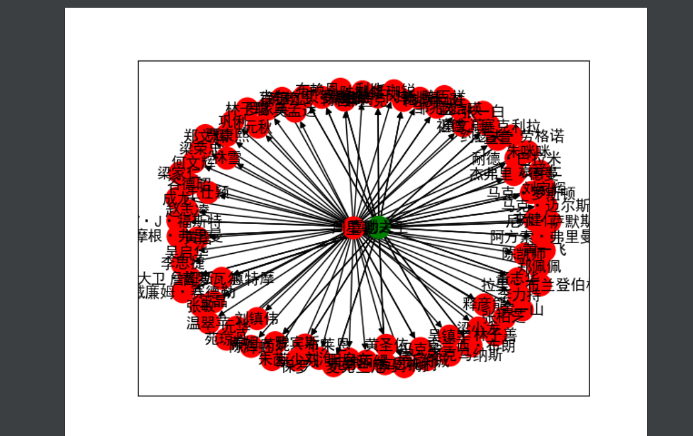
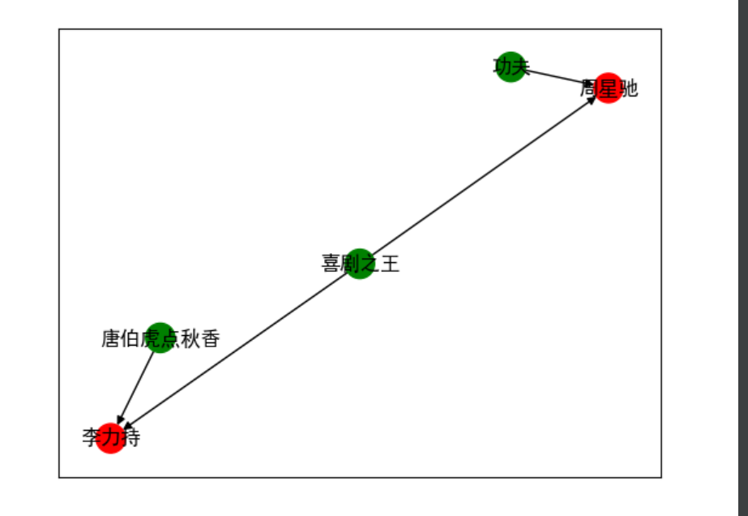
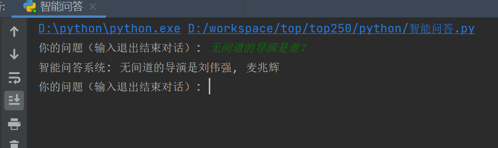

# 豆瓣电影知识图谱构建（豆瓣电影top250可视化）

## python+networkx库

已经有电影排名数据不用再自己爬取

## 实现功能图路径搜索、查询关系、智能问答

1.图的顶点数据：

（1）电影结点（电影ID，电影名称，标签）

（2）导演结点（导演ID，导演名称，标签）

（3）演员结点（演员ID，演员名称，标签）

（4）类型结点（类型ID，类型名称，标签）

顶点数据保存在node.csv文件

2.边：顶点的关系：

（1）导演——电影关系（导演）

（2）演员——电影关系（出演）

（3）导演——演员关系（合作）

（4）电影——类型关系（属于）

边、顶点关系保存在movie_relation.csv文件

## 图路径搜索

输入某个演员、导演。能查询其参与作品、导演作品。

结果展示：



## 查询关系。

输入2个顶点，能查询其关系。如周星驰，无间道2，查询2个顶点路径关系。如果不存在关系，提示无。如果有多个关系，能展示最短路径，需要可视化展示。

结果展示：



## 3. 智能问答。

输入无间道的导演是谁？基于图的搜索后，能给出答案。

使用python的re模块

````

## 使用正则表达式提取问题中的电影名称和问题类型(自己定义的问题，可以再继续加)
match = re.search(r'(.+)的(.+)是谁', question)
match_relation = re.search(r'(.+)和(.+)是什么关系', question)

## 判断属于哪个问题进入图搜索返回结构
    if match:
        movie_name = match.group(1)
        question_type = match.group(2)
        if G.has_node(movie_name):
            # 使用 NetworkX 查找与电影相关的导演节点
            directors = [node for node in G.neighbors(movie_name) if G.edges[movie_name, node]['weight'] == 3]

            if directors:
                if question_type == '导演':
                    return f"{movie_name}的{question_type}是{', '.join(directors)}"
                else:
                    return f"抱歉，我不知道{movie_name}的{question_type}是什么。"
            else:
                return f"抱歉，我不知道{movie_name}的导演是谁。"
        else:
            return f"抱歉，我不知道{movie_name}这部电影。"
    elif match_relation:
        entity1 = match_relation.group(1)
        entity2 = match_relation.group(2)
        # 使用 NetworkX 检查两个实体之间的关系
        if G.has_edge(entity1, entity2):
            relation_weight = str(G[entity1][entity2]['weight'])
            return f"{entity1}和{entity2}是{get_type(relation_weight)}关系"
        elif G.has_edge(entity2, entity1):
            relation_weight = str(G[entity2][entity1]['weight'])
            return f"{entity2}和{entity1}是{get_type(relation_weight)}关系"
        else:
            return f"抱歉，我不知道{entity1}和{entity2}之间的关系。"
    else:
        return "抱歉，我无法理解你的问题。"
````

结果展示：


